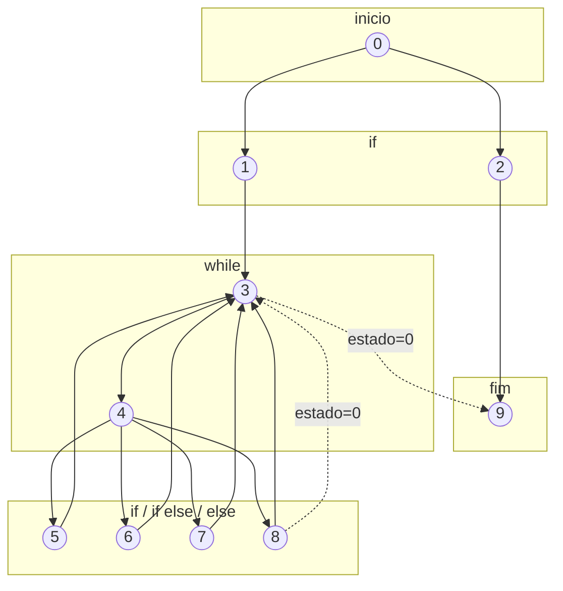

# ContadorTeste — Análise de Testes


---

## 1. Grafo do Módulo



---

## 2. Complexidade Ciclomática

A complexidade ciclomática é calculada pela fórmula:

```
P + 1
```

Onde:
- **P** = Número de predicados (condições)


> **Complexidade Ciclomática = 6**


---

## 3. Erro Encontrado

### 'index' não era auto incrementado
No código original a variável 'index' era inicializada, porém ao entrar no primeiro if, a linha de código originalmente estava: 

```java
index = index = 1;
```

O correto é: 
```java
index = index + 1;
```


---
> ERRO ADICIONAL
### Comparação de Strings com `==`

No código original, as comparações de `String` eram feitas com `==`:

```java
if (s[index] == "B") { ... }
```

Em Java, `==` compara a **referência do objeto** na memória, não o conteúdo. Isso pode retornar `false` mesmo quando os valores são iguais, dependendo de como a `String` foi criada.

**Correção aplicada:**

```java
if (s[index].equals("B")) { ... }
```

### Ausência da String `"\n"`

O loop `while(estado != 0)` só encerra quando encontra o caractere `"\n"` no array. Sem ele, o `index` continua incrementando até estourar o array:

```
Exception: ArrayIndexOutOfBoundsException
```

**Correção aplicada:** o array sempre é montado com `"\n"` na última posição:

```java
String[] entrada = new String[linha.length() + 1];
for (int i = 0; i < linha.length(); i++) {
    entrada[i] = String.valueOf(linha.charAt(i));
}
entrada[linha.length()] = "\n"; // string obrigatório
```

---

## 4. Resultados e Análise dos Testes


### Cenários de Teste

A complexidade ciclomática é **6**, porém a análise do grafo revelou que:

- O caminho `0 > 1 > 3 > 9` é **inalcançável**, pois `while(estado != 0)` com `estado = 1` sempre executa o corpo ao menos uma vez (do-while).
- O caminho `0 > 1 > 3 > 4 > 8 > 3 > 9` já está coberto pelo cenário mínimo `{"A", "\n"}`.

Portanto, os **4 cenários reais e independentes** são:

| # | Caminho | Entrada | Resultado Esperado |
|---|---------|---------|-------------------|
| 1 | `0 > 2 > 9` | `{"X", "\n"}` | `-1` |
| 2 | `0 > 1 > 3 > 4 > 8 > 3 > 9` | `{"A", "\n"}` | `0` |
| 3 | `0 > 1 > 3 > 4 > 5 > 3 > 4 > 8 > 3 > 9` | `{"A", "B", "\n"}` | `0` |
| 4 | `0 > 1 > 3 > 4 > 6 > 3 > 4 > 8 > 3 > 9` | `{"A", "B", "C", "\n"}` | `1` |
| 5 | `0 > 1 > 3 > 4 > 7 > 3 > 4 > 8 > 3 > 9` | `{"A", "D", "\n"}` | `0` |

---
